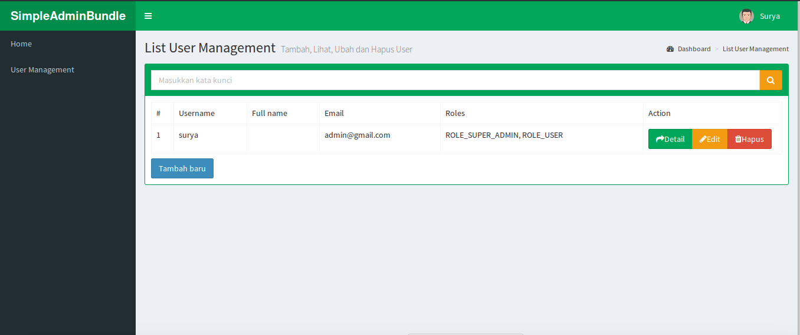

#IhsanSimpleAdminBundle#

**THIS DOCUMENT IS NOT UP TO DATE**

IhsanSimpleBundle makes it easy for you to create a simple backed using Symfony

####Features####
1. **CRUD** operations using Doctrine Entities
2. Fulltext **search** and **pagination**
3. **Responsive** design using [AdminLTE](https://github.com/almasaeed2010/AdminLTE) template
4. **Easy to customize** any part of bundle
5. **User Management ready** using [FOSUserBundle](https://github.com/FriendsOfSymfony/FOSUserBundle)
6. **Event listener** make it easy for you to hook the process
7. **Easy Menu creation** using [KNPMenuBundle](https://github.com/KnpLabs/KnpMenuBundle)

####Instalation####

Just add this line and update your composer

~~~~~ json
"require": {
    "knplabs/knp-paginator-bundle": "~2.4",
    "knplabs/knp-menu-bundle": "~2",
    "fkr/cssurlrewrite-bundle": "~1.0",
    "friendsofsymfony/user-bundle": "2.0.x-dev",
    "ihsanudin/compressor": "dev-master",
    "ihsanudin/simple-admin-bundle": "0.0.*@dev"
}
~~~~~

~~~~~ php
$bundles = array(
    ....
    new FOS\UserBundle\FOSUserBundle(),
    new Fkr\CssURLRewriteBundle\FkrCssURLRewriteBundle(),
    new Knp\Bundle\PaginatorBundle\KnpPaginatorBundle(),
    new Knp\Bundle\MenuBundle\KnpMenuBundle(),
    new Ihsan\SimpleAdminBundle\IhsanSimpleAdminBundle(),
);
~~~~~

Run ``php app/console assets:install web`` to install assets

Add Route

~~~~~ yml
ihsan_simple_crud:
    resource: @IhsanSimpleAdminBundle/Controller
    type: annotation
~~~~~

**Please read official documentation of all external bundles for instalation and setup before continue**

~~~~~ yml
ihsan_simple_admin:
    menu: 'main_menu' #read KNPMenuBundle for more detail
    security:
        user:
            form_class: user_form #you can use service or FQCN (Fully Qualified Class Name)
            entity_class: AppBundle\Entity\User #same entity class that you pass for FOSUserBundle
~~~~~

####Your First Admin Class#####

Create your admin only in 3 step

**1. Create Entity Class**

~~~~~ php
<?php
namespace AppBundle\Entity;

/**
 * Author: Muhammad Surya Ihsanuddin<surya.kejawen@gmail.com>
 * Url: http://blog.khodam.org
 */

use Doctrine\ORM\Mapping as ORM;
use AppBundle\Entity\Product\Product;
use Doctrine\Common\Collections\ArrayCollection;
Ihsan\SimpleAdminBundle\Entity\EntityInterface

/**
 * @ORM\Entity()
 * @ORM\Table(name="app_product_category")
 */
class ProductCategory implements EntityInterface
{
    /**
     * @ORM\Id
     * @ORM\Column(name="id", type="integer")
     * @ORM\GeneratedValue(strategy="AUTO")
     */
    protected $id;

    /**
     * @ORM\ManyToOne(targetEntity="ProductCategory", inversedBy="child")
     * @ORM\JoinColumn(name="parent_id", referencedColumnName="id", onDelete="CASCADE")
     */
    protected $parentCategory;

    /**
     * @ORM\OneToMany(targetEntity="ProductCategory", mappedBy="parentCategory")
     */
    protected $child;

    /**
     * @ORM\Column(name="code", type="string", length=17)
     */
    protected $code;

    /**
     * @ORM\Column(name="product_category_name", type="string", length=255)
     */
    protected $name;

    /**
     * @ORM\OneToMany(targetEntity="Product", mappedBy="category")
     */
    protected $products;

    /**
     * Constructor
     */
    public function __construct()
    {
        $this->products = new ArrayCollection();
    }

    /**
     * Set code
     *
     * @param string $code
     * @return ProductCategory
     */
    public function setCode($code)
    {
        $this->code = $code;

        return $this;
    }

    /**
     * Set name
     *
     * @param string $name
     * @return ProductCategory
     */
    public function setName($name)
    {
        $this->name = $name;

        return $this;
    }

    public function setParentCategory(ProductCategoryInterface $productCategory)
    {
        $this->parentCategory = $productCategory;

        return $this;
    }

    /**
     * @return string
     */
    public function getCode()
    {
        return $this->code;
    }

    /**
     * @return string
     */
    public function getId()
    {
        return $this->id;
    }

    /**
     * @return string
     */
    public function getName()
    {
        return $this->name;
    }

    /**
     * @return ProductCategory
     */
    public function getParentCategory()
    {
        return $this->parentCategory;
    }

    public function __toString()
    {
        return $this->getName();
    }
}
~~~~~

**2. Create Form**

~~~~~php
<?php
namespace AppBundle\Form;

/*
 * Author: Muhammad Surya Ihsanuddin<surya.kejawen@gmail.com>
 * Url: http://blog.khodam.org
 */

use Symfony\Component\Form\AbstractType;
use Symfony\Component\Form\FormBuilderInterface;
use Symfony\Component\OptionsResolver\OptionsResolverInterface;

class ProductCategoryType extends AbstractType
{
    const FORM_NAME = 'product_category';

    public function buildForm(FormBuilderInterface $builder, array $options)
    {
        $builder->add('parentCategory', 'entity', array(
            'class' => $entity,
            'label' => 'Parent',
            'property' => 'name',
            'attr' => array(
                'class' => 'form-control',
            ),
        ));

        $builder->add('code', 'text', array(
            'attr' => array(
                'class' => 'form-control',
            )
        ));

        $builder->add('name', 'text', array(
            'attr' => array(
                'class' => 'form-control',
            )
        ));

        $builder->add('save', 'submit', array(
            'label' => 'Save',
            'attr' => array(
                'class' => 'btn btn-primary',
            )
        ));
    }

    public function setDefaultOptions(OptionsResolverInterface $resolver)
    {
        $resolver->setDefaults(array(
            'data_class' => 'AppBundle\Entity\ProductCategory',
            'translation_domain' => 'AppBundle',
            'intention'  => self::FORM_NAME,
        ));
    }

    public function getName()
    {
        return self::FORM_NAME;
    }
}
~~~~~

**3. Create Controller**
~~~~~php
<?php
namespace AppBundle\Controller;

/**
 * Author: Muhammad Surya Ihsanuddin<surya.kejawen@gmail.com>
 * Url: http://blog.khodam.org
 */

use Sensio\Bundle\FrameworkExtraBundle\Configuration\Route;
use Ihsan\SimpleAdminBundle\Controller\CrudController;
use Ihsan\SimpleAdminBundle\Annotation\Crud;

/**
 * @Route("/user")
 * @Crud(entityClass="AppBundle\Entity\ProductCategory", formClass="AppBundle\Form\ProductCategoryType")
 */
class ProductCategoryController extends CrudController
{
}
~~~~~

####Customize Page Title And Page Description####

To customize page title and page description is very easy. You just add ``@PageTitle`` and ``@PageDescription`` to your controller look like example below

~~~~~ php
<?php
namespace Ihsan\SimpleAdminBundle\Controller;

/**
 * Author: Muhammad Surya Ihsanuddin<surya.kejawen@gmail.com>
 * Url: http://blog.khodam.org
 */

use Sensio\Bundle\FrameworkExtraBundle\Configuration\Route;
use Sensio\Bundle\FrameworkExtraBundle\Configuration\Method;

use Ihsan\SimpleAdminBundle\Annotation\PageTitle;
use Ihsan\SimpleAdminBundle\Annotation\PageDescription;

/**
 * @Route("/user")
 *
 * @PageTitle("user.page_title")
 * @PageDescription("user.page_description")
 */
class UserController extends CrudController
{
}
~~~~~

You can also use ``@Crud`` global annotation with key ``pageTitle`` and ``pageDescription`` to override the page title and page description.

####Customize Grid Fields####

Same as page title and page description but using ``@GridFields`` and ``gridFields`` on ``@Crud`` global annotation
The value of parameter must be an array

~~~~~ php
<?php
namespace Ihsan\SimpleAdminBundle\Controller;

/**
 * Author: Muhammad Surya Ihsanuddin<surya.kejawen@gmail.com>
 * Url: http://blog.khodam.org
 */

use Sensio\Bundle\FrameworkExtraBundle\Configuration\Route;
use Sensio\Bundle\FrameworkExtraBundle\Configuration\Method;
use Ihsan\SimpleAdminBundle\Annotation\GridFields;

/**
 * @Route("/user")
 * @GridFields({"username", "fullName", "email", "roles"})
 */
class UserController extends CrudController
{
}
~~~~~

####Customize Show Fields####

Same as page title and page description but using ``@ShowFields`` and ``showFields`` on ``@Crud`` global annotation
The value of parameter must be an array

~~~~~ php
<?php
namespace Ihsan\SimpleAdminBundle\Controller;

/**
 * Author: Muhammad Surya Ihsanuddin<surya.kejawen@gmail.com>
 * Url: http://blog.khodam.org
 */

use Sensio\Bundle\FrameworkExtraBundle\Configuration\Route;
use Sensio\Bundle\FrameworkExtraBundle\Configuration\Method;

use Ihsan\SimpleAdminBundle\Annotation\ShowFields;

/**
 * @Route("/user")
 * @ShowFields({"username", "fullName", "email", "roles"})
 */
class UserController extends CrudController
{
}
~~~~~

####Customize Action Template####

Use ``@NewActionTemplate`` with template path as parameter for override new template or use ``newActionTemplate`` on ``@Crud`` global annotation

Use ``@EditActionTemplate`` with template path as parameter for override edit template or use ``editActionTemplate`` on ``@Crud`` global annotation

Use ``@ShowActionTemplate`` with template path as parameter for override show template or use ``showActionTemplate`` on ``@Crud`` global annotation

Use ``@ListActionTemplate`` with template path as parameter for override list template or use ``listActionTemplate`` on ``@Crud`` global annotation

####Normalize Filter####

Use ``@NormalizeFilter`` without parameter

####Event Listener#####

This bundle have 2 event ``ihsan.simple_admin.pre_persist_event`` and ``ihsan.simple_admin.post_flush_event``. Just create an event listener to listen that events.

####Configuration Reference####

~~~~~ yml
ihsan_simple_admin:
    app_title: 'IhsanSimpleAdmin'
    per_page: 10
    identifier: 'id'
    date_time_format: 'd-m-Y' #php date time format
    menu: 'main'
    filter: 'name'
    translation_domain: 'IhsanSimpleAdminBundle'
    security:
        user:
            form_class: user_form
            entity_class: AppBundle\Entity\User
    grid_action: #not work for this time
        show: true
        edit: true
        delete: true
    themes:
        dashboard: 'IhsanSimpleAdminBundle:Index:index.html.twig'
        form_theme: 'IhsanSimpleAdminBundle:Form:fields.html.twig'
        pagination: 'IhsanSimpleAdminBundle:Layout:pagination.html.twig'
~~~~~

####TODO####
- Improvement translation
- Grid Action (done)
- Add PreSaveEvent (done)
- Add Utilities for FOSUserBundle (delete user using URL)
- Add UserController Route is Optional (done)
- Filter List Result Event (done)
- Add Test

####Resources We Use####
- https://github.com/almasaeed2010/AdminLTE
- https://github.com/FriendsOfSymfony/FOSUserBundle
- https://github.com/KnpLabs/KnpMenuBundle
- https://github.com/KnpLabs/KnpPaginatorBundle
- https://github.com/fkrauthan/FkrCssURLRewriteBundle